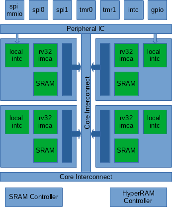

# ClusterV-SoC
Cluster-V SoC contains a cluster of four RISC-V rv32imac cores. 
Each core has local SRAM and a local interrupt controller for 
interprocessor-interrupt (IPI). The cluster has shared
SRAM and HyperRAM controllers, and a peripheral ring.

